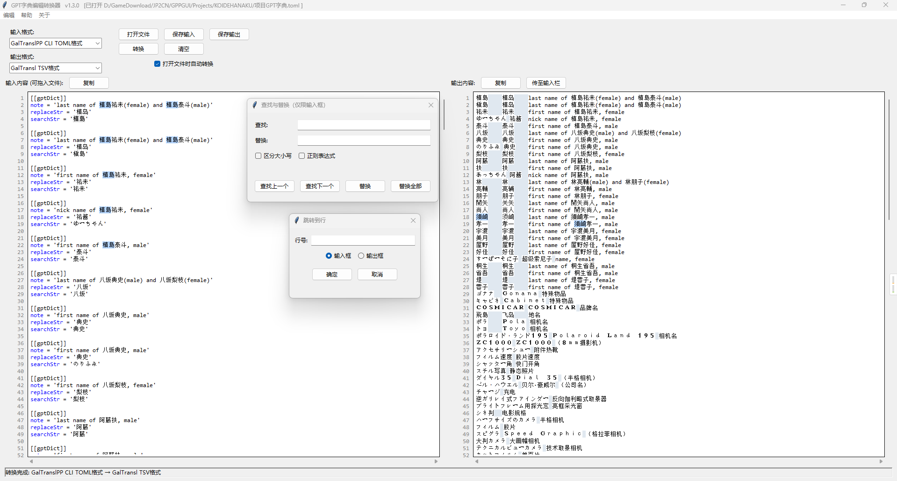

<!-- markdownlint-disable MD010 -->
# GPTDictEditor

本项目用于编写Galgame AI翻译时所用的项目GPT字典，支持  
语法高亮、注释和取消注释、查找替换（支持在特定字段进行）等功能，  
且支持多种翻译器的字典格式之间的互相转换



## 使用方法

### 1、环境配置

- **操作系统**: Windows 10 或 Windows 11 (Linux和mac上未测试)
- **版本控制工具**: [git](https://git-scm.com/)
- [python 3.13.7](https://www.python.org/downloads/release/python-3137/) ：不保证其它python版本能否正常运行

### 2、安装依赖

```cmd
pip install -r .\requirements.txt
```

### 3、克隆本仓库

```cmd
git clone https://github.com/natsumerinchan/GPTDictEditor.git
cd .\GPTDictEditor
```

### 4、运行脚本

```cmd
python .\main.py
```

或双击运行`run.bat`

### 5、打包为exe（可选）

```cmd
pip install pyinstaller

pyinstaller --noconfirm --onefile --windowed --add-data "docs/help.md;docs" --name "GPT字典编辑转换器" main.py
```

### 6、详细使用教程

详见[help.md](./help.md)

## 支持的翻译器及其GPT字典格式

### [xd2333/GalTransl](https://github.com/GalTransl/GalTransl.git)

#### GalTransl_TSV

```txt
//格式为日文[Tab]中文[Tab]解释(可不写)，参考项目wiki

原文1	译文1	注释1
原文2	译文2	注释2
原文3	译文3	注释3
```

### [julixian/GalTranslPP](https://github.com/julixian/GalTranslPP.git)

#### GPPGUI_TOML

```toml
gptDict = [
	{ org = '原文1', rep = '译文1', note = '注释1' },
	{ org = '原文2', rep = '译文2', note = '注释2' },
	{ org = '原文3', rep = '译文3', note = '注释3' },
]
```

#### GPPCLI_TOML

```toml
[[gptDict]]
note = '注释1'
replaceStr = '译文1'
searchStr = '原文1'

[[gptDict]]
note = '注释2'
replaceStr = '译文2'
searchStr = '原文2'

[[gptDict]]
note = '注释3'
replaceStr = '译文3'
searchStr = '原文3'
```

### [NEKOparapa/AiNiee](https://github.com/NEKOparapa/AiNiee.git) 和 [neavo/LinguaGacha](https://github.com/neavo/LinguaGacha.git)

#### AiNiee_JSON

```json
[
  {
    "src": "原文1",
    "dst": "译文1",
    "info": "注释1"
  },
  {
    "src": "原文2",
    "dst": "译文2",
    "info": "注释2"
  },
  {
    "src": "原文3",
    "dst": "译文3",
    "info": "注释3"
  }
]
```
